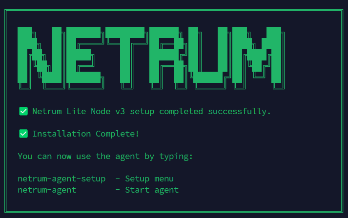
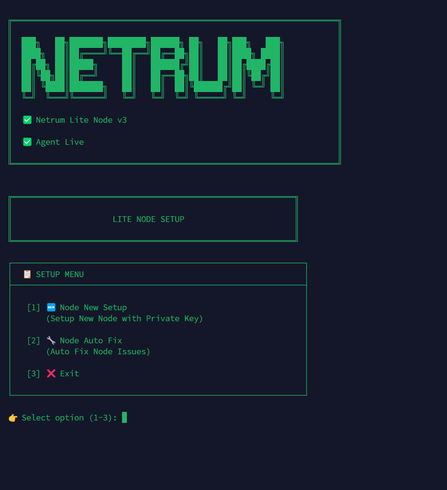
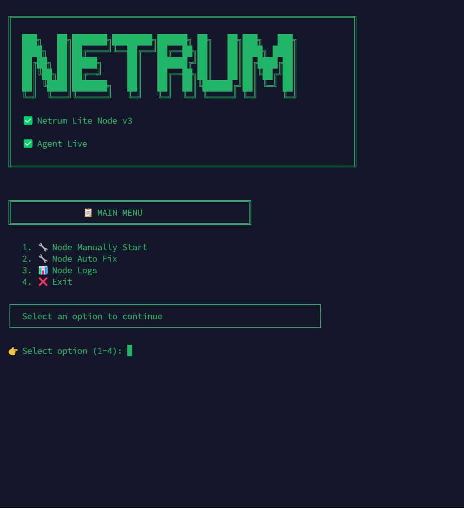

<p align="center">
  
</p>


# Netrum Lite Node v3

> Lightweight CLI node for the Netrum decentralized compute network.

---

# What is Netrum Lite Node v3?

Netrum Lite Node v3 is a lightweight command-line application that allows anyone to participate in the Netrum decentralized compute network.

It securely creates a wallet, registers your node on-chain, synchronizes node information, receives compute tasks, mines NPT tokens, and allows you to claim rewards directly from your terminal.

Designed for VPS and low-resource servers, Netrum Lite Node v3 provides a fast setup experience with fully automated workers, background services, and continuous synchronization.

### Key Features

- Lightweight CLI application
- One-command installation
- Secure local wallet management
- On-chain node registration
- Automatic node synchronization
- Background mining worker
- Automatic task worker
- Token management
- Daily reward claiming
- Auto update support
- Ubuntu systemd services
- Built for VPS and dedicated servers

---

# Hardware & Network Requirements

To run **Netrum Lite Node v3** smoothly, your system should meet the following minimum requirements.

## Hardware Requirements

| Component | Minimum | Recommended  |
|-----------|---------|------------- |
| CPU       | 2 Cores | 2+ Cores     |
| RAM       | 4 GB    | 6 GB or More |
| Disk      | 50 GB   | 100 GB SSD   |

> SSD storage is highly recommended for better node performance and stability.

## Network Requirements

| Connection | Minimum |
|------------|----------|
| Download   | 10 Mbps |
| Upload     | 10 Mbps |

> A stable internet connection is required for synchronization, mining, task execution, and reward claiming.

---

# Supported Operating System

| Operating System | Status |
|------------------|--------|
| Ubuntu 20.04 LTS | ✅ Supported |
| Ubuntu 22.04 LTS | ✅ Supported |
| Ubuntu 24.04 LTS | ✅ Supported |

---

# System Dependencies

Before installing **Netrum Lite Node v3**, make sure your system has the required packages installed.

## Ubuntu

```bash
sudo apt update && sudo apt install -y python3.10 python3.10-venv python3-pip python3-apt command-not-found curl git unzip build-essential
```

If your system reports issues with `python3-apt` or `command-not-found`, run:

```bash
sudo apt install --reinstall -y python3-apt command-not-found
```

---

## Verify Python Version

```bash
python3 --version
```

Expected output:

```text
Python 3.10.x
```

> Netrum Lite Node v3 officially supports **Python 3.10**.

> The installer will automatically verify the Python version before installation.


---

# Official Node Installation

Deploy the latest **Netrum Lite Node v3** using the official installer.

```bash
curl -sSL https://lite-node.netrumlabs.live/linux/install.sh | bash
```

### The installer automatically performs:

- ✅ Python 3.10 verification
- ✅ Dependency installation
- ✅ Latest Lite Node download
- ✅ Virtual environment setup
- ✅ Default `.env` creation
- ✅ CLI installation
- ✅ System verification
- ✅ Ready-to-use node setup


---

# Installation Directory Structure

After installation, Netrum Lite Node v3 creates the following directories on your system.

| Directory | Purpose |
|-----------|---------|
| `~/netrum-lite` | Main Netrum Lite Node installation directory. Contains the CLI application, workers, configuration, and source code. |
| `/var/usr/netrum-system` | Stores internal system files, background workers, update services, and runtime components. |
| `/var/usr/netrum-backups` | Stores automatic backups created by the node before important updates or recovery operations. |

> ⚠️ Do not manually modify or delete files inside **`/var/usr/netrum-system`** unless instructed by Netrum Labs. These files are managed automatically by the node.

> 💾 Backup files stored in **`/var/usr/netrum-backups`** can be used to restore your node if an update or system failure occurs.


---


# Node Setup

After the installation is complete, the installer will display:

```text
✅ Netrum Lite Node v3 setup completed successfully.

Installation Complete!

You can now use the agent by typing:

netrum-agent-setup   - Setup menu
netrum-agent         - Start agent
```


---

# The first command you should run is:

```bash
netrum-agent-setup
```

This command launches the interactive setup wizard and prepares your node for the Netrum Network.


<p align="center">
  
</p>


## Netrum Agent Setup

The setup menu guides you through the complete node configuration process.

```text
📋 Setup Menu

[1] Node New Setup
    Setup a new node using your private key.

[2] Node Auto Fix
    Automatically detect and repair common node issues.

[3] Exit
```

### Option 1 — Node New Setup

This option performs the complete first-time node setup.

During the setup process, Netrum Lite Node will:

- Generate your local wallet configuration.
- Securely store your private key on your machine.
- Validate your system requirements.
- Register your node in server.
- Create a authentication token.
- Synchronize node information.
- Prepare the mining environment.
- Configure all required background services.

> ⚠️ Your private key never leaves your machine. It is stored locally and used only for transaction signing.

---

### Option 2 — Node Auto Fix

Node Auto Fix scans your installation and automatically repairs common issues, including:

- Missing configuration files
- Registration issues
- Mining token problems
- Synchronization issues
- Background worker issues
- System validation checks

This command is useful whenever your node is not working as expected.


---

After the setup finishes successfully, your node is ready to start.

Run:

```bash
netrum-agent
```

---

# Main Menu

When you start the agent, the following menu will appear.

<p align="center">
  
</p>

```
1. 🔧 Node Manually Start
2. 🔧 Node Auto Fix
3. 📊 Node Logs
4. ❌ Exit
```

---

## Step 1 — Node Manually Start

For the very first time, select:

```text
1. 🔧 Node Manually Start
```

This opens the complete manual setup menu.

```
1. 🔧 System
2. 📝 Register
3. 🎫 Setup Auto Token Worker
4. 🤖 Setup Auto Task Worker
5. 🔄 Setup Auto Sync Worker
6. ⛏️ Mining (Start + Auto Worker Setup)
7. 💰 Claim
8. 🔙 Back to Main Menu
```

Complete the setup from **top to bottom**.

Recommended order:

1. 🔧 System
2. 📝 Register
3. 🎫 Setup Auto Token Worker
4. 🤖 Setup Auto Task Worker
5. 🔄 Setup Auto Sync Worker
6. ⛏️ Mining (Start + Auto Worker Setup)
7. 💰 Claim

Once these steps are complete, your node is fully configured and all required background workers will be running automatically.

---

## Auto Fix

If your node encounters any issue, select:

```text
2. 🔧 Node Auto Fix
```

The Auto Fix and scan system automatically checks and repairs common problems, including:

```
1. 🔍 Auto Scan Full Node
2. 🔧 Auto Fix Node
3. ⬅️ Back
```

In most cases, running **Node Auto Fix** is enough to restore the node without manual troubleshooting.

---

## View Node Logs

To monitor your node status, return to the Main Menu and select:

```text
3. 📊 Node Logs
```

This displays:

```
1. 📋 Task Logs
2. 🔄 Sync Logs
3. ⛏️ Mining Logs
4. 🔙 Back to Main Menu
```

Use this menu whenever you want to monitor your node.

---


# Need Help?

If you encounter any errors while setting up or running **Netrum Lite Node v3**, don't worry.

Please visit our **Discord Server** and create a post in the **`#node-support`** channel.

Share the following information to help us troubleshoot your issue faster:

- Operating System and Ubuntu version
- Error message
- Terminal screenshot
- Relevant logs (if available)

Our team and community will help you resolve the issue as quickly as possible.

### Join the Netrum Discord Community

For additional support, join our Discord community:

Discord Server: https://discord.com/invite/87hVVDuppf


---

# Updates

Netrum Lite Node includes an automatic update system.

The update worker periodically checks for new releases and safely installs them without requiring manual intervention.

No additional action is required from the node operator.

---

# Security

- Private keys are stored locally.
- Private keys are never transmitted to Netrum servers.
- Transaction signing is performed locally.
- Mining rewards are claimed directly from your wallet.


---

## License

Netrum Lite Node is source-available software.

You are free to:

- ✅ Download and run your own node.
- ✅ Inspect the source code.
- ✅ Report bugs and security issues.
- ✅ Submit feature requests and GitHub Issues.

You may NOT:

- ❌ Modify and redistribute the source code.
- ❌ Publish modified versions.
- ❌ Use the source code in another project.
- ❌ Commercially distribute the software.

See the LICENSE file for complete terms.


---

<p align="center">

Built with ❤️ by <strong>Netrum Labs</strong>

</p>


