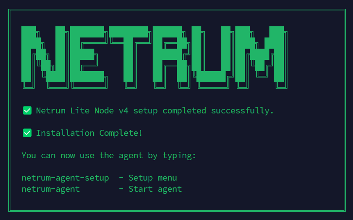
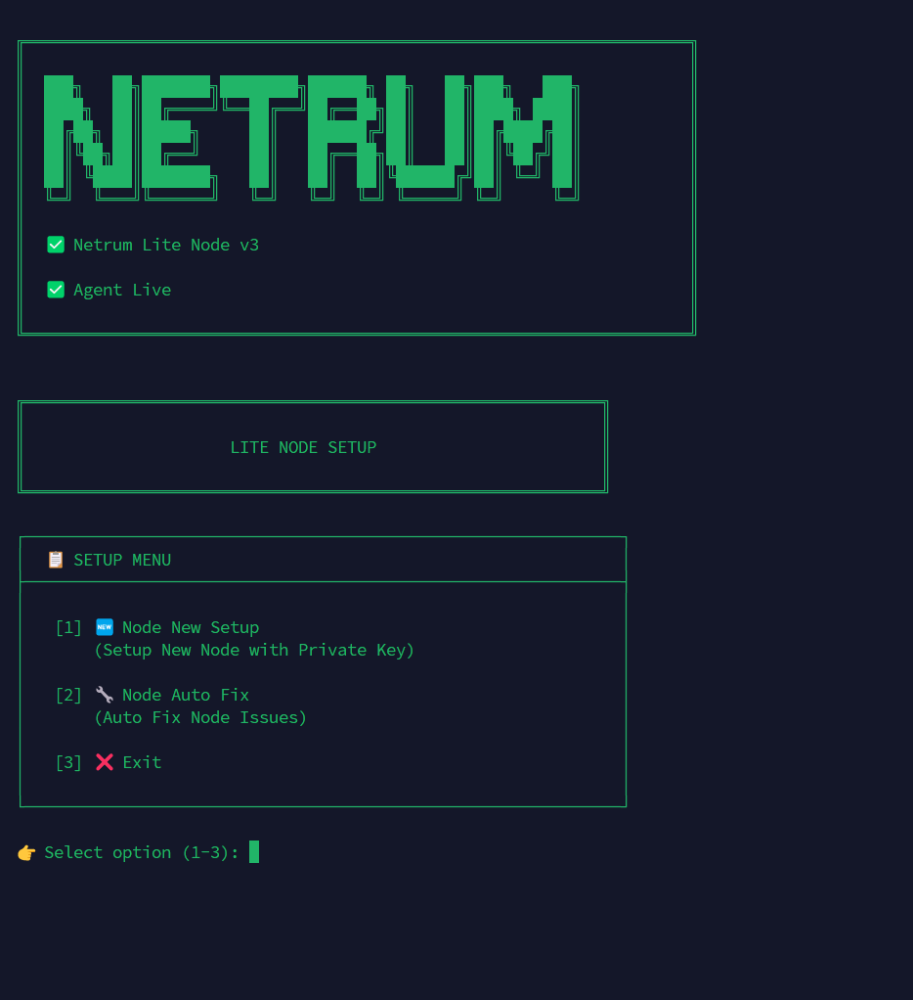
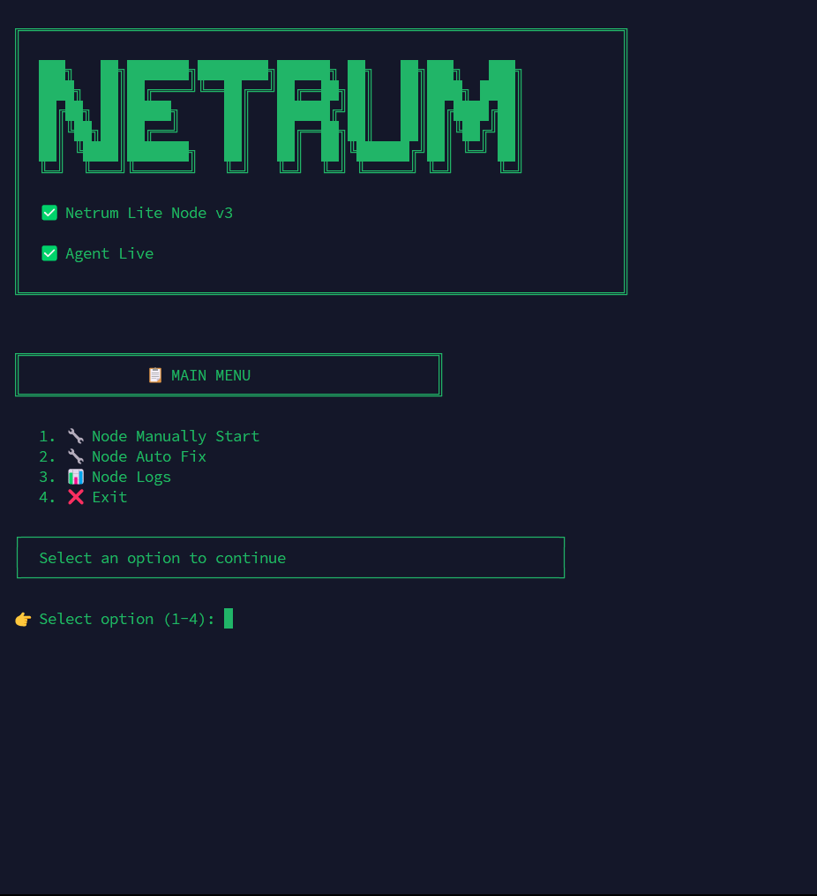

<p align="center">
  
</p>


# Netrum Lite Node v4

> Lightweight CLI node for the Netrum decentralized compute network.


## Table of Contents

- What is Netrum Lite Node v4?
- Hardware & Network Requirements
- Supported Operating System
- Install System Dependencies
- Official Node Installation
- Installation Directory Structure
- Node Setup
- The First Command You Should Run
- Setup Menu
- New Node Setup
- Email Setup
- Main Menu
- Start Node Services
- AutoClaim
- Node Auto Fix
- Node Logs
- Need Help?
- Updates
- Security
- License


---

# What is Netrum Lite Node v4?

**Netrum Lite Node v4** is a lightweight command-line application that allows anyone to participate in the Netrum decentralized compute network.

The Lite Node securely manages your local wallet, registers your node, synchronizes node information, receives compute tasks, participates in mining, and allows you to claim mining rewards directly from your node.

Netrum Lite Node v4 is designed for VPS and low-resource servers, providing a simple setup experience with automated background services and continuous node operation.

### Key Features

- Lightweight CLI application
- One-command installation
- Secure local wallet management
- On-chain node registration
- Server-side node registration
- Automatic node synchronization
- Background mining worker
- Automatic task worker
- Centralized mining token management
- Automatic reward claiming
- AutoClaim background service
- Email notification support
- Automatic update support
- Ubuntu systemd services
- Built for VPS and dedicated servers


---

# Hardware & Network Requirements

To run **Netrum Lite Node v4** smoothly, your system should meet the following minimum requirements.

## Hardware Requirements

| Component | Minimum | Recommended |
|-----------|---------|-------------|
| CPU | 2 Cores | 2+ Cores |
| RAM | 4 GB | 6 GB or More |
| Disk | 50 GB | 100 GB SSD |

> SSD storage is highly recommended for better node performance and stability.

## Network Requirements

| Connection | Minimum |
|------------|---------|
| Download | 10 Mbps |
| Upload | 10 Mbps |

> A stable internet connection is required for synchronization, mining, task execution, AutoClaim, and reward claiming.


---

# Supported Operating System

| Operating System | Status |
|------------------|--------|
| Ubuntu 20.04 LTS | ✅ Supported |
| Ubuntu 22.04 LTS | ✅ Supported |
| Ubuntu 24.04 LTS | ✅ Supported |


---

# Install System Dependencies

Before installing **Netrum Lite Node v4**, make sure your system has the required packages installed.

## Ubuntu

```bash
sudo apt update && sudo apt install -y python3.10 python3.10-venv python3-pip python3-apt command-not-found curl git unzip build-essential
````

If your system reports issues with `python3-apt` or `command-not-found`, run:

```bash
sudo apt install --reinstall -y python3-apt command-not-found
```

## Verify Python Version

```bash
python3 --version
```

Expected output:

```text
Python 3.10.x
```

> Netrum Lite Node v4 officially supports **Python 3.10**.

> The installer will automatically verify the Python version before installation.

---

# Official Node Installation

Deploy the latest **Netrum Lite Node v4** using the official installer.

```bash
curl -sSL https://lite-node.netrumlabs.live/linux/install.sh | bash
```

### The installer automatically performs:

* ✅ Python 3.10 verification
* ✅ Dependency installation
* ✅ Latest Lite Node download
* ✅ Virtual environment setup
* ✅ Default `.env` creation
* ✅ CLI installation
* ✅ System verification
* ✅ Ready-to-use node environment

---

# Installation Directory Structure

After installation, Netrum Lite Node v4 uses the following directories.

| Directory                 | Purpose                                                                                                               |
| ------------------------- | --------------------------------------------------------------------------------------------------------------------- |
| `~/netrum-lite`           | Main Netrum Lite Node installation directory containing the CLI application, workers, configuration, and source code. |
| `/var/usr/netrum-system`  | Stores internal system files, background workers, update services, and runtime components.                            |
| `/var/usr/netrum-backups` | Stores automatic backups created by the node before important updates or recovery operations.                         |

> ⚠️ Do not manually modify or delete files inside **`/var/usr/netrum-system`** unless instructed by Netrum Labs. These files are managed automatically by the node.

> 💾 Backup files stored in **`/var/usr/netrum-backups`** can be used to restore your node if an update or system failure occurs.

---

# Node Setup

After the installation is complete, the installer will display:

```text
✅ Netrum Lite Node v4 setup completed successfully.

Installation Complete!

You can now use the agent by typing:

netrum-agent-setup   - Setup menu
netrum-agent         - Start node
```

---

# The First Command You Should Run

After installation, run:

```bash
netrum-agent-setup
```

This command launches the interactive setup menu and prepares your node for the Netrum Network.

<p align="center">
  
</p>

# Setup Menu

The setup command provides the following menu:

```text
┌─────────────────────────────────────────────────────────────┐
│  📋 SETUP MENU                                              │
├─────────────────────────────────────────────────────────────┤
│                                                             │
│   [1] 🆕 New Node Setup                                     │
│       (Complete new node configuration)                     │
│                                                             │
│   [2] 📧 Email Setup                                        │
│       (Manage email configuration)                          │
│                                                             │
│   [3] 🔧 Node Auto Fix                                      │
│       (Auto Fix Node Issues)                                │
│                                                             │
│   [4] ❌ Exit                                               │
│                                                             │
└─────────────────────────────────────────────────────────────┘
```

---

# New Node Setup

Select:

```text
[1] 🆕 New Node Setup
```

This option performs the complete first-time node configuration.

During the setup process, Netrum Lite Node will prepare the required node configuration and services.

The setup includes:

* System validation
* Wallet configuration
* Secure local private key management
* Server registration
* Node authentication
* On-chain node registration
* Node synchronization configuration
* Mining configuration
* Task worker configuration
* Required background services

> ⚠️ Your private key never leaves your machine. It is stored locally and used only for transaction signing.

### Token Management

Netrum Lite Node v4 uses centralized token management.

The mining authentication token is managed by the node application and shared by the required workers.

The token manager automatically handles:

* Token creation
* Token expiration tracking
* Token refresh
* Token validation
* Concurrent token refresh protection

> No separate Token Worker setup is required in Netrum Lite Node v4.

---

# Email Setup

Select:

```text
[2] 📧 Email Setup
```

Email Setup allows you to manage the email configuration associated with your node.

Email functionality can be used for important node notifications, including AutoClaim-related notifications.

The email configuration is managed separately from the main node setup so it can be updated when required.

---

# Node Auto Fix

Select:

```text
[3] 🔧 Node Auto Fix
```

Node Auto Fix automatically scans the node installation and attempts to repair common configuration and service problems.

The system can check areas such as:

* Missing configuration files
* Node registration issues
* Authentication token issues
* Synchronization issues
* Mining worker issues
* Task worker issues
* Background service issues
* System configuration problems

The Auto Fix system is designed to reduce the need for manual troubleshooting.

> If your node is not working as expected, running **Node Auto Fix** is recommended before performing manual repairs.

---

# Start the Node

After completing the initial setup, start the main node interface:

```bash
netrum-agent
```

This launches the main Netrum Lite Node control menu.

---

# Main Menu

The current Netrum Lite Node v4 main menu is:

<p align="center">
  
</p>

```text
╔═══════════════════════════════════════════════════════════╗
║                     📋 MAIN MENU                          ║
╚═══════════════════════════════════════════════════════════╝

   1. 🔧 Start Node Services
   2. 🤖 Start AutoClaim
   3. 🔧 Node Auto Fix
   4. 📊 Node Logs
   5. ❌ Exit
```

---

# Start Node Services

Select:

```text
1. 🔧 Start Node Services
```

This option is used to start and manage the core Netrum node services.

The core node services include the components required for normal node operation, such as:

* Task processing
* Node synchronization
* Mining
* Node runtime services

Netrum Lite Node v4 manages authentication tokens internally through the centralized TokenManager.

> **No separate Token Worker needs to be started manually.**

Once the required node services are running, the node can continue operating in the background through systemd services.

---

# AutoClaim

Select:

```text
2. 🤖 Start AutoClaim
```

AutoClaim allows the node to automatically monitor and claim available mining rewards.

AutoClaim runs as a dedicated background systemd service, allowing it to continue operating even after leaving the CLI menu.

The AutoClaim menu provides:

```text
1. ▶️ Start AutoClaim
2. ⏹️ Stop AutoClaim
3. 📋 Check Logs AutoClaim
4. 🔙 Back
```

## Start AutoClaim

Select:

```text
1. ▶️ Start AutoClaim
```

This sets up and starts the AutoClaim worker service.

The service is configured to:

* Run continuously in the background
* Monitor claim availability
* Prepare claim transactions
* Check wallet balance
* Sign transactions locally
* Broadcast transactions to the network
* Verify claim transactions
* Continue running after leaving the menu

## Stop AutoClaim

Select:

```text
2. ⏹️ Stop AutoClaim
```

This stops the AutoClaim background service.

Stopping AutoClaim does not remove your node configuration or wallet information.

## Check AutoClaim Logs

Select:

```text
3. 📋 Check Logs AutoClaim
```

This displays recent AutoClaim worker logs and can be used to troubleshoot claim-related issues.

## AutoClaim Email Notifications

AutoClaim can send email notifications when a claim cannot be completed because the wallet does not have enough ETH required for the transaction.

Failure notifications are protected by a notification cooldown.

* First failure → Email sent immediately
* Repeated failures → No repeated email during the cooldown
* After 6 hours → Reminder email can be sent again
* Successful claims are not delayed by the failure-email cooldown

> The failure notification cooldown only applies to failure notifications. Successful claim notifications, where configured, are sent normally.

---

# Node Auto Fix

Select:

```text
3. 🔧 Node Auto Fix
```

Node Auto Fix can be used from the main agent menu whenever the node encounters an operational problem.

The Auto Fix system can scan and repair common node issues.

Typical checks include:

```text
1. 🔍 Auto Scan Full Node
2. 🔧 Auto Fix Node
3. ⬅️ Back
```

Use **Auto Fix** when one or more node services are not operating correctly.

---

# Node Logs

Select:

```text
4. 📊 Node Logs
```

The Node Logs menu provides access to logs from the core background workers.

Typical log categories include:

```text
1. 📋 Task Logs
2. 🔄 Sync Logs
3. ⛏️ Mining Logs
4. 🔙 Back to Main Menu
```

Logs can be used to monitor node activity and troubleshoot operational issues.

---

# Background Services

Netrum Lite Node v4 uses Linux **systemd** to run background services.

This allows the node to continue operating independently of the interactive CLI.

Core node functionality can run through background workers for:

* Task processing
* Synchronization
* Mining
* AutoClaim

The node's authentication token is managed internally by the application and does not require a dedicated token systemd worker.

---

# Need Help?

If you encounter any errors while setting up or running **Netrum Lite Node v4**, please visit the **Netrum Labs Discord Server** and create a post in the **`#node-support`** channel.

Share the following information to help troubleshoot the issue:

* Operating System and Ubuntu version
* Error message
* Terminal screenshot
* Relevant worker logs
* Node version

Our team and community will help you resolve the issue as quickly as possible.

## Join the Netrum Discord Community

Discord Server:

[https://discord.com/invite/87hVVDuppf](https://discord.com/invite/87hVVDuppf)

---

# Updates

Netrum Lite Node v4 includes an automatic update system.

The update system periodically checks for new releases and safely updates the node when a new version is available.

Before important updates, the node can create backups of the existing installation.

During updates, legacy or outdated background services are cleaned up and the current node services are configured for the new version.

No additional action is normally required from the node operator.

---

# Security

Netrum Lite Node is designed to keep sensitive wallet information local to the node.

* Private keys are stored locally.
* Private keys are never transmitted to Netrum servers.
* Transaction signing is performed locally.
* AutoClaim transactions are signed locally.
* Mining rewards are claimed directly from the node wallet.
* Authentication tokens are managed locally by the node application.

> Never share your private key, wallet credentials, authentication credentials, or sensitive configuration files with anyone.

---

# License

Netrum Lite Node is source-available software.

You are free to:

* ✅ Download and run your own node.
* ✅ Inspect the source code.
* ✅ Report bugs and security issues.
* ✅ Submit feature requests and GitHub Issues.

You may NOT:

* ❌ Modify and redistribute the source code.
* ❌ Publish modified versions.
* ❌ Use the source code in another project.
* ❌ Commercially distribute the software.

See the `LICENSE` file for complete terms.

---

<p align="center">

Built with ❤️ by <strong>Netrum Labs</strong>

</p>
```

